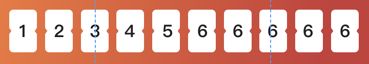
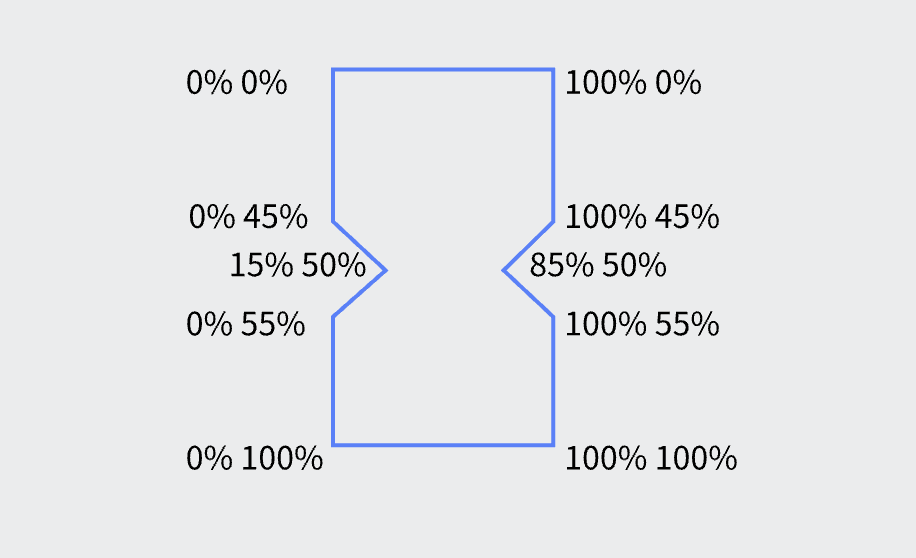

---
# 这是文章的标题
title: clip-path 裁剪
# 这是页面的图标
icon: page
# 这是侧边栏的顺序
order: 1
# 设置写作时间
date: 2022-06-28
# 一个页面可以有多个分类
category:
  - 前端
# 一个页面可以有多个标签
tag:
  - Css
---

很多时候因为项目需要我们需要画一些不规则的图形，这个时候就可以用到css的clip-path 比如:  



拿到这样UI图首先可以确定后段返回的肯定是字符串，前端处理成数组后循环出数字，再给每个数字做成卡片的样式  

简单的理清思路后就是敲代码了，前面都没什么难度，主要是卡片的样式是一个不规则的长方形，查询了多种方法之后选用了clip-path来做

---
首先来看clip-path的**定义**和**属性**

::: tip 定义
clip-path 属性使用裁剪方式创建元素的可显示区域。区域内的部分显示，区域外的隐藏。可以指定一些特定形状  
:::

::: warning 属性
clip-path: clip-source|basic-shape|margin-box|border-box|padding-box|content-box|fill-box|stroke-box|view-box|none|initial|inherit;
:::

| 值        | 描述           |
| ------------- |:-------------:|
| clip-source      | 用 URL 表示剪切元素的路径 |
| basic-shape      | 将元素裁剪为基本形状：圆形、椭圆形、多边形或插图 |
| margin-box | 使用外边距框作为引用框 |
| border-box | 使用边框作为引用框 |
| padding-box | 使用内边距框作为引用框 |
| content-box | 使用内容框作为引用框 |
| fill-box | 使用对象边界框作为引用框 |
| stroke-box | 使用笔触边界框（stroke bounding box）作为引用框 |
| view-box | 使用最近的 SVG 视口（viewport）作为引用框。 |
| none | 这是默认设置。 没有剪辑 |
| initial | 设置属性为默认值 |
| inherit | 属性值从父元素继承。 |

裁剪的时候会从左上角以百分比坐标轴的方式顺时针方向裁剪  
画一个图就很容易理解了



``` css
numberList_item {
    clip-path: polygon(0% 0%, 100% 0%, 100% 45% ,85% 50% ,100% 55% ,100% 100% ,0% 100% ,0% 55% ,15% 50% ,0% 45%);
}
```
